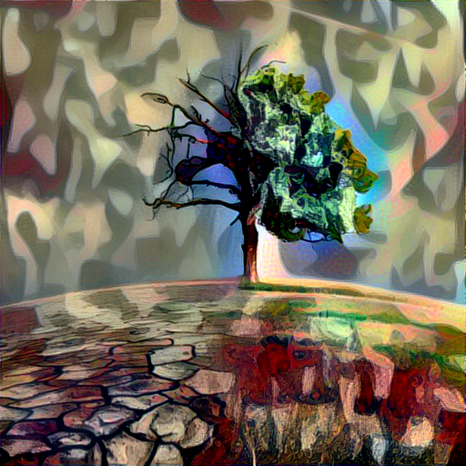

# Deep-Learning-Artistic-Style-Transfer-with-VGG16

<table><tr><td align="center"><a href="https://github.com/umit-ozturk">  <b>Ümit Öztürk</b></a> </td></tr></table>  

## Installation
Clone the repository and create a virtual environment.

    $ git clone https://github.com/umit-ozturk/Deep-Learning-Artistic-Style-Transfer-with-VGG16.git
	$ cd Deep-Learning-Artistic-Style-Transfer-with-VGG16
	$ virtualenv -p python3 env
	$ source env/bin/activate
    $ pip install -r requirements.txt
    $ cd art-transfer
    
## Run Application
    
    $ python main.py

## Screenshots

## Images

## Results

